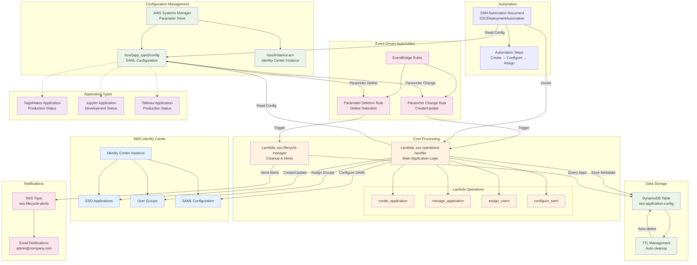

# SSO Application Deployment Architecture

## Overview
End-to-end automated SSO application deployment system using AWS Identity Center with Lambda integration, EventBridge automation, and lifecycle management.

## Architecture Components

### Core Services
- **AWS Identity Center**: SSO application management
- **Lambda Functions**: Application operations and lifecycle management
- **EventBridge**: Automated triggers for parameter changes
- **Systems Manager**: Configuration storage and automation
- **DynamoDB**: Application metadata and TTL management
- **SNS**: Lifecycle alerts and notifications

## Architecture Diagram

