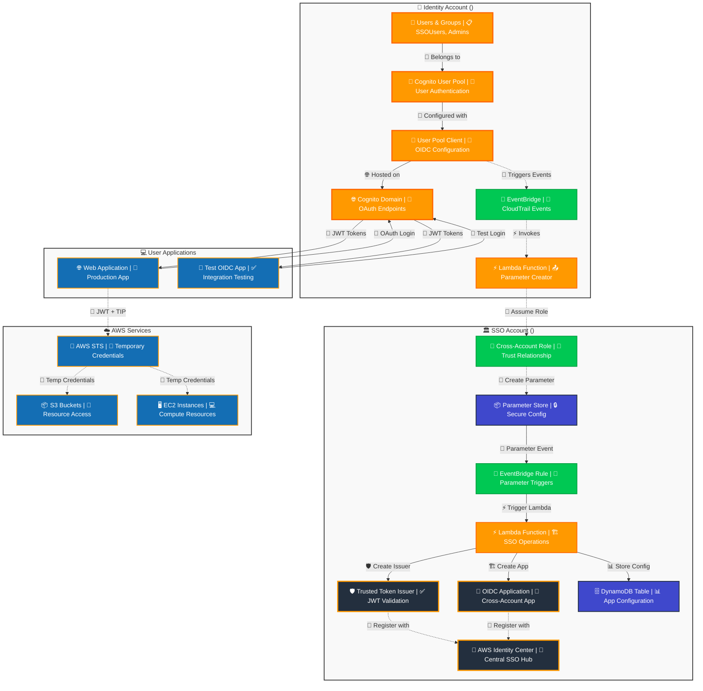
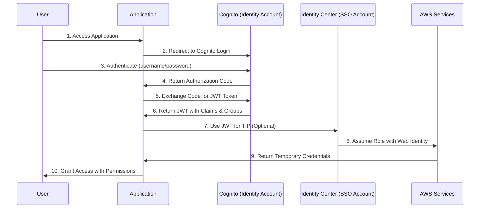
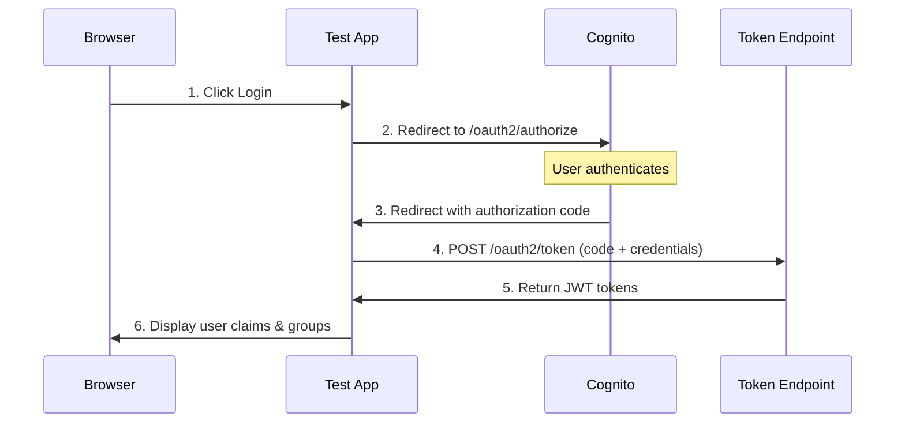

# AWS Identity Center OIDC with Cognito Cross-Account Setup

## Overview

This document provides a comprehensive end-to-end setup for implementing AWS Identity Center (IDC) OIDC integration with Amazon Cognito across multiple AWS accounts using Trusted Identity Propagation (TIP).

## Architecture Overview

## 🔄 Cross-Account Authentication Flow

## OAuth 2.0 OIDC Flow Diagram

